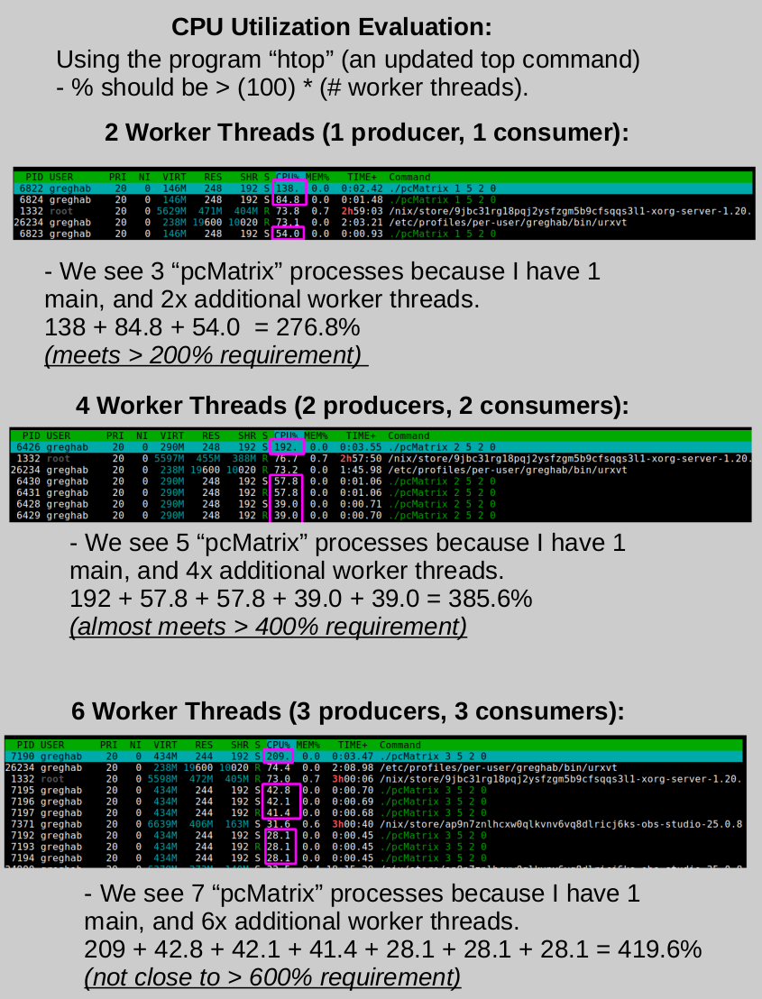

# Parallel-Matrix-Multiplier
Producer threads create various sized NxN randomized matrices, and store it into a shared bound buffer (a shared fixed array of matrices).

Consumer threads consume NxN matrices from the shared bounded buffer, and continues to consume matrices until it can find a 2nd matrix that is valid to multiply with the first matrix it consumed.
- (To multiply two matrices: A(row)xB(col) * B(row)xC(col). The number of columns of the first array, must equal the number of rows of the 2nd array).

# CPU Utilization Analysis:
- It works pretty well up to 4 threads (385% / 400%), but has issues scaling up to 6 threads (419% / 600%).
  - (At 6 threads, it isn't running 100% efficiently, and threads are sometimes waiting for resources to be freed).

